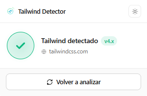

# Tailwind Detector

> Extensión de Chrome que detecta automáticamente si un sitio usa Tailwind CSS, identifica la versión, y enciende el icono en tiempo real.

## Características

- 🔍 **Detección automática por pestaña** — el icono se enciende sin acciones manuales
- 🏷️ **Versión exacta** — muestra `v3.4.1`, `v4.0.14`, etc. cuando el CSS conserva los comentarios del compilador
- ✨ **Soporte v3 y v4** — reconoce las firmas nuevas (`@theme`, `@utility`, `@property --tw-*`) y las clásicas (`--tw-*`)
- 🌓 **Tema claro/oscuro** — respeta la preferencia del sistema
- ⚡ **Rápido** — fetch paralelo con priorización inteligente, cache por sesión
- 🔒 **Sin telemetría** — todo el análisis ocurre localmente

## Instalación

### Desde la Chrome Web Store

[Enlace pendiente de publicación]

### Modo desarrollador

1. Clona el repo: `git clone https://github.com/tuusuario/tailwind-detector.git`
2. Abre `chrome://extensions`
3. Activa el **Modo desarrollador** (arriba a la derecha)
4. Click en **Cargar descomprimida** → selecciona la carpeta `src/`

## Cómo funciona

La extensión analiza las hojas de estilo de la página buscando firmas únicas de Tailwind:

| Firma | Versión | Confiabilidad |
|-------|---------|---------------|
| Comentario `/*! tailwindcss v... */` | Exacta | Alta |
| `@property --tw-*` | v4 | Alta |
| `@theme`, `@utility`, `@custom-variant` | v4 | Alta |
| Tokens `--color-*`, `--spacing-*` | v4 | Media |
| `--tw-*` sueltos | v3 | Media |
| Script del CDN Play | v3 | Alta |

Si el comentario no aparece en el CSSOM (los navegadores lo descartan), fetchea el CSS crudo desde el `href` del `<link>` para buscarlo ahí.

## Stack

- Manifest V3
- Vanilla JavaScript (sin build step, sin dependencias)
- Chrome APIs: `chrome.action`, `chrome.storage`, `chrome.runtime`, `chrome.tabs`

## Estructura

\`\`\`
src/
├── manifest.json    # Configuración de la extensión
├── background.js    # Service worker (icono, cache por pestaña)
├── content.js       # Script inyectado (detección)
├── popup.html/css/js # UI del popup
└── icons/           # Iconos activos/inactivos en 16, 48, 128px
\`\`\`

## Contribuir

Los PRs son bienvenidos. Casos donde ayuda mucho contribuir:

- Sitios donde la detección falla (abre un issue con la URL y qué esperabas)
- Nuevas firmas de futuras versiones de Tailwind
- Mejoras de accesibilidad en el popup
- Traducciones

## Privacidad

Cero recolección de datos. Detalles en [PRIVACY.md](PRIVACY.md).

## Licencia

MIT © [Tu nombre](https://github.com/tuusuario)